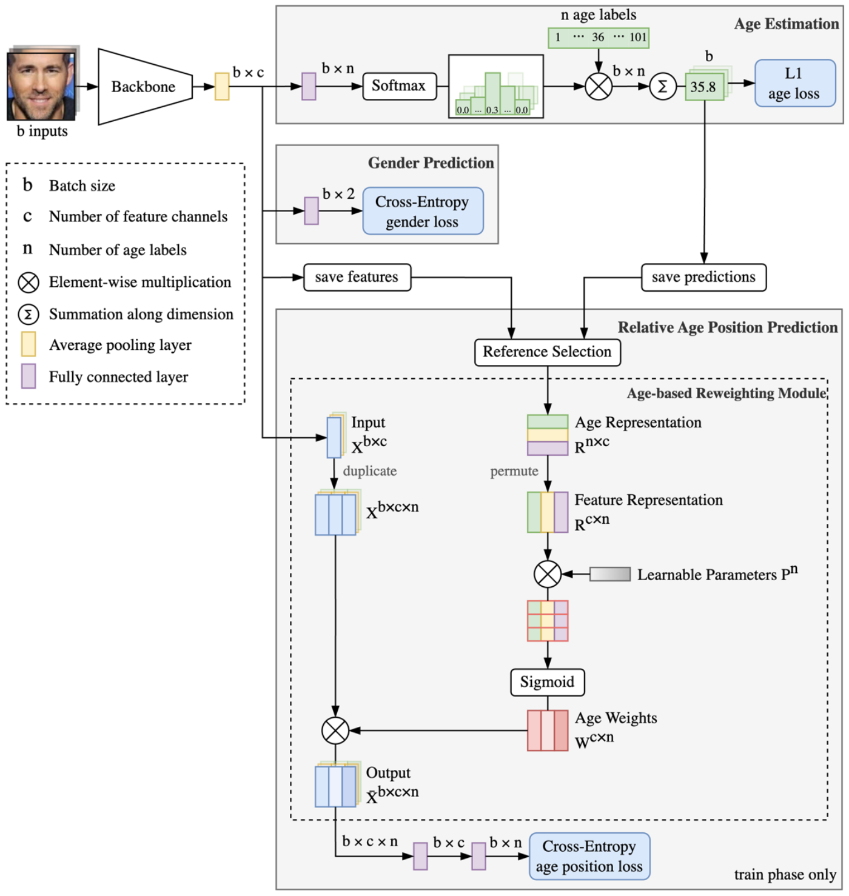

# Relative Age Position Learning for Facial Age Estimation

This is the Pytorch implementation of the paper "[Relative Age Position Learning for Face-based Age Estimation]()".

<p align="center"></p>

## Paper

This paper introduces the concept of relative age position learning to supplement the learning
process for age estimation models. Drawing inspiration from feature re-calibration modules that prioritize
features based on their importance, a novel age-based re-weighting module is developed to enhance the
feature representation in the proposed age estimation method. The proposed re-weighting module obtains
the features of selected references for each age and further exploits them to re-weight the features of input
images based on the age importance. The resulting re-calibrated features are then assessed for relative
age position prediction. Through extensive experiments, we demonstrate that the proposed approach
outperforms other state-of-the-art age estimation methods on three challenging benchmark datasets for facial
age estimation such as AgeDB, AFAD, and CACD.

## Datasets
- [AgeDB](https://ibug.doc.ic.ac.uk/resources/agedb/)
- [AFAD](https://github.com/John-niu-07/tarball)
- [CACD](https://bcsiriuschen.github.io/CARC/)

The folder `datalists` contains `.csv` files for each dataset. The folder structure used for implementation:
```
./datalists/
    afad.csv
    agedb.csv
    cacd.csv
```
The `fold` columns in `.csv` files identify `train`, `valid`, `test` splits of datasets. You can use your own paths to dataset images. 
See in [Evaluation and Training](#evaluation-and-training).


## Dependencies 
- Python 3
- Pytorch


## Preprocessing
- AgeDB. The original images of dataset are used.
- AFAD. The original images of dataset are used.
- CACD. We use the implementation of MTCNN by [urbaneman](https://github.com/urbaneman/Face_crop_align_mtcnn) to crop and align images.


## Pretrained Models
The backbone we use is IR50, pre-trained on MS-Celeb-1M Dataset and modified by [Talented-Q](https://github.com/Talented-Q/POSTER_V2). 
We pre-trained the IR50 again on [IMDB-Clean](https://github.com/yiminglin-ai/imdb-clean) dataset. 
We provide the pretrained checkpoints for IR50 [here](https://drive.google.com/drive/folders/1NzBuqvcdvviyPXIgZ0kMitELGQaxvAlD?usp=drive_link). 
You need to put the pretrained model under `pretrained_model` folder.
```
./pretrained_model/ir50_imdb.pt
```


## Trained Models
The trained checkpoints for AgeDB, AFAD and CACD datasets can be downloaded [here](https://drive.google.com/drive/folders/1EvwO7UGlARqLyhWRYUlChw8-oL-0ifZT?usp=drive_link). 

In order to evaluate the trained models you can put them under `trained_checkpoints` folder or use your own paths to the models. See in [Evaluation and Training](#evaluation-and-training).


## Evaluation and Training 
In `opt.py` file, you can configure the phase type (train or test), dataset name, the paths to images, the path to trained model or to save new checkpoints for model and other hyperparameters. 
Besides, you can configure the arguments explicitly in command line before running. 
### Testing
You can test the trained model on AgeDB dataset by running:
```
python main.py --phase test --data_name agedb --data_path path/to/agedb/images/
```
You can test the trained model on AFAD dataset by running:
```
python main.py --phase test --data_name afad --data_path path/to/afad/images/ --model_path ./trained_checkpoints/afad.pt
```
You can test the trained model on CACD dataset by running:
```
python main.py --phase test --data_name cacd --data_path path/to/cacd/images/ --model_path [./trained_checkpoints/cacd.pt or own/path/to/cacd/checkpoints]
```
### Training and Validation
You can train and validate the model on AgeDB dataset by running:
```
python main.py --phase train --data_name agedb --data_path path/to/agedb/images/ --model_path path/to/save/checkpoints
```
You can train and validate the model on AFAD dataset by running:
```
python main.py --phase train --data_name afad --data_path path/to/afad/images/ --model_path path/to/save/checkpoints --seed 123
```
You can train and validate the model on CACD dataset by running:
```
python main.py --phase train --data_name cacd --data_path path/to/cacd/images/ --model_path path/to/save/checkpoints --lr 1e-6
```
## Citing
If you find this work useful, please cite the following paper:
```bibtex

```
